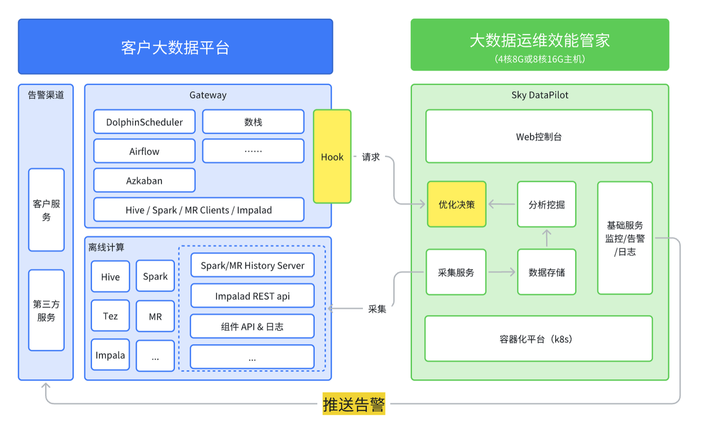

# Sky DataPilot 服务实例部署文档

## 概述


`九象（Sky DataPilot）是一款专注于开源大数据平台的数据化运维与效能提升专家产品，致力于以数据化、智能化的方式为大数据平台提供运维产品服务，帮助客户提升平台的稳定性和效能。Sky DataPilot集成了贝联珠贯独特的大数据任务优化技术，在保证任务稳定运行的前提下，自动化的提升任务执行效率，提升集群使用效率或降低成本30%以上。` 
`本文向您介绍如何开通计算巢上的Sky DataPilot服务，以及部署流程和使用说明。`


## 计费说明

`本产品在云市场平台提供的版本为社区版本，产品本身免费使用，但需要付费购买计算资源使用权限。`

```
Sky DataPilot 在计算巢上的费用主要涉及：

- 所选vCPU与内存规格
- 系统盘类型及容量
- 数据盘类型及容量

计费方式包括：

- 按量付费（小时）
- 包年包月

预估费用在创建实例时可实时看到。

```

## 部署架构



## RAM账号所需权限

`Sky DataPilot 服务实例部署需要使用RAM账号，请确保RAM账号具有以下权限：`

```
| 权限策略名称 | 备注 |
| --- | --- |
| AliyunECSFullAccess | 管理云服务器服务（ECS）的权限 |
| AliyunVPCFullAccess | 管理虚拟私有云（VPC）的权限 |
```

## 部署流程

### 部署步骤

`获取部署链接后，根据需要选择ecs规格、数据盘类型、数据盘大小、网络类型、VPC、子网等参数，完成服务实例部署。其中数据盘建议选择essd云盘，磁盘规格和网络要求参考：`[官方文档](https://lccomputing.feishu.cn/wiki/wikcnBZFeOm6OuiX6KRysuZWbGb?fromScene=spaceOverview)

### 使用说明
`部署完成后，即可通过公网IP或ECS实例的内网IP访问Sky DataPilot服务。`
```
具体使用请参考官方文档：https://lccomputing.feishu.cn/wiki/wikcnBZFeOm6OuiX6KRysuZWbGb?fromScene=spaceOverview
```

## 联系我们

欢迎访问贝联珠贯官网（[https://www.lccomputing.com/](https://www.lccomputing.com/)）了解更多信息。

扫码关注微信公众号，技术博客、活动通知不容错过：

